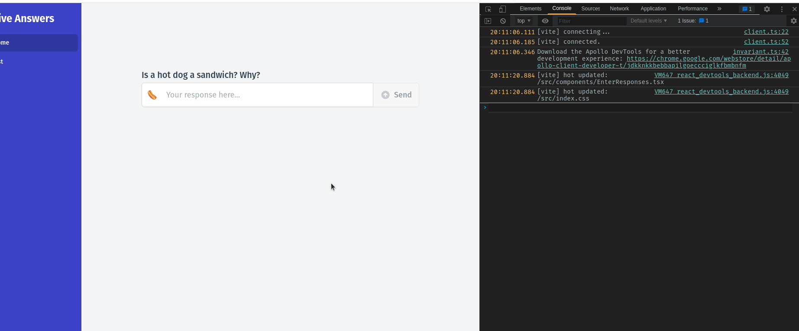
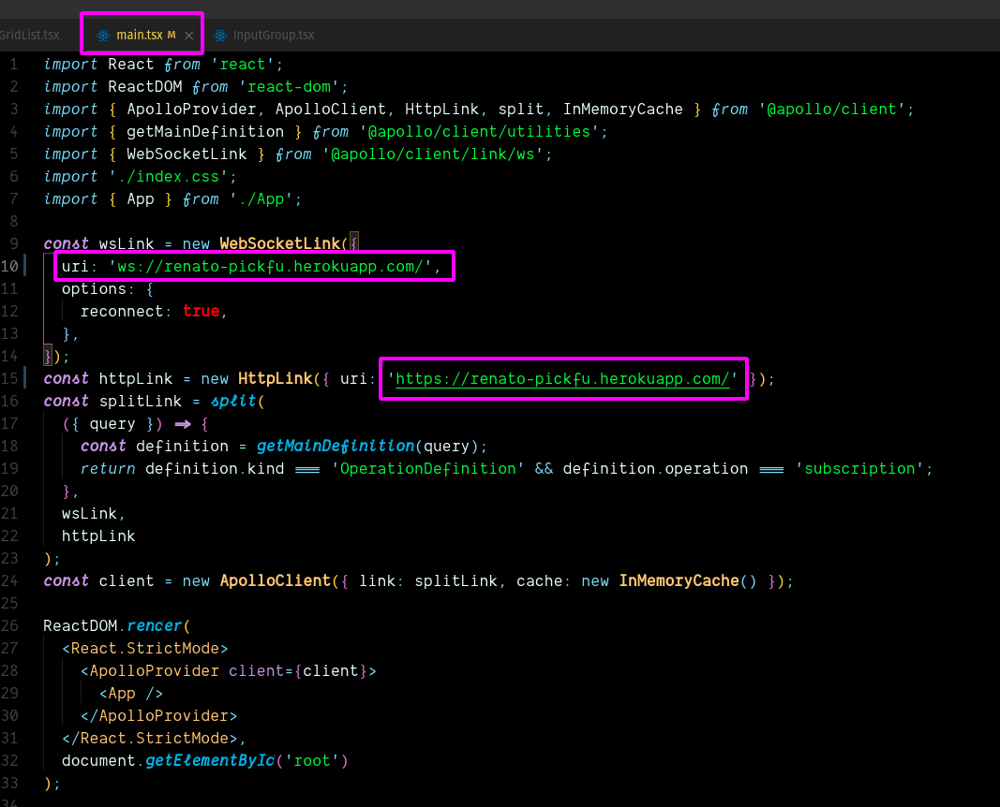

# PickFu Frontend Challenge

## Scaffolding the project

Will use [Vite](https://vitejs.dev/) tool to configure the project

```bash
yarn create vite
```

with Options:

- Project name: pickfu-frontend
- template react-ts

## Set Router and Style framework

### Router:

```bash
yarn add react-router-dom
```

```bash
yarn add @types/react-router-dom -D
```

### Style framework [TailwindCSS](https://tailwindcss.com/)

deps:

```bash
yarn add autoprefixer postcss tailwindcss -D
```

create config files:

```bash
touch tailwind.config.js postcss.config.js
```

At `src/index.css`

```css
@import 'tailwindcss/base';

@import 'tailwindcss/components';

@import 'tailwindcss/utilities';
```

## Lint and Format

Minimal Typescript linting rules applied at [`.eslintrc.js`](.eslintrc.js)  
We do not need lint config files and others so there we have [`.eslintignore`](.eslintignore) file

Also need to config Prettier formatter to play nice with the linter

Install dep:

```bash
yarn add -D eslint-config-prettier
```

Then only add `"prettier"` to the "extends" array in [`.eslintrc.js`](.eslintrc.js)

```json
{
  "extends": ["some-other-config-you-use", "prettier"]
}
```

Add preference rules for Prettier at [`.prettierrc`](.prettierrc)

```json
{
  "semi": true,
  "tabWidth": 2,
  "printWidth": 100,
  "singleQuote": true,
  "trailingComma": "es5",
  "jsxBracketSameLine": true
}
```

## Set Apollo-Client

We'll need [`Apollo-Client`](https://www.apollographql.com/docs/react/) to connect our React App to Server.  
deps:

```bash
yarn add @apollo/client graphql
```

Then Connect at [`src/main.tsx`](src/main.tsx)

```typescript
const httpLink = createHttpLink({ uri: 'http://localhost:4000' });
const client = new ApolloClient({ link: httpLink, cache: new InMemoryCache() });

ReactDOM.render(
  <React.StrictMode>
    <ApolloProvider client={client}>
      <App />
    </ApolloProvider>
  </React.StrictMode>,
  document.getElementById('root')
);
```

## Connect [`EnterResponses`](src/components/EnterResponses.tsx)

We'll use `useMutation` hook from `Apollo-Client`

```typescript
const [createResponse] = useMutation<CreateResponse_Response, CreateResponse_Variables>(
  CREATE_RESPONSE_MUTATION,
  {
    variables: { createResponseInput: { response: response.value } },
  }
);
```

Run:
<br >


<br>

## Set real time updates for the [`ResponseList`](src/components/ResponseList.tsx) component

We'll use [`Apollo-Client Subscriptions`](https://www.apollographql.com/docs/react/data/subscriptions/) to get real-time updates for the list of saved responses,  
so any time a new response the server will push this new data directly to connected clients

All configurations are set in [`src/main.tsx`](src/main.tsx), the takeaway here is: will have two connections  
 1 HTTP for the _queries_ and _mutations_  
 2 Websocket for _subscriptions_

Results:

<video src="screenshots/real-time-updates-for-response-list.mp4" controls width="1200"></video>

## Call deployed GraphQL api:

Now that we have deployed GraphQL API to Heroku we can call from the Frontend  
The url for Heroku server is [`https://renato-pickfu.herokuapp.com/`](https://renato-pickfu.herokuapp.com/)  
Need some changes at [`src/main.tsx`](src/main.tsx):


